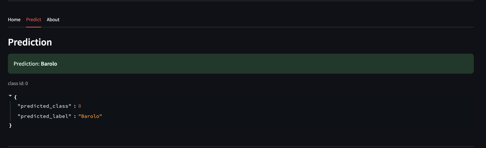

```markdown
# 🍷 Wine Classification Demo (FastAPI + Streamlit)

This lab is part of a Streamlit Lab exercise.
It combines FastAPI as the backend inference service with Streamlit as the interactive frontend dashboard.

The goal is to classify wines into one of three cultivars — Barolo, Grignolino, or Barbera using 13 measurable chemical properties (like alcohol content, phenols, and color intensity).

The lab demonstrates how a trained scikit-learn model can be served via FastAPI and seamlessly integrated into a Streamlit interface for real-time predictions.
---

## Project Structure

```

project_root/
│
├── FastAPI_Labs/
│   ├── model/
│   │   └── wine_model.pkl
│   └── src/
│       ├── main.py         # FastAPI backend (predict endpoint)
│       ├── train.py        # Model training script
│       ├── data.py, predict.py, etc.
│
├── Streamlit_Labs/
│   ├── data/
│   │   └── test.json      
│   └── src/
│       └── Dashboard.py   
│
└── requirements.txt

````

---

##  Installation & Setup

### 1️⃣ Clone the repo
```bash
git clone https://github.com/<your-username>/wine-classification-demo.git
cd wine-classification-demo
````

### 2️⃣ Create and activate a virtual environment

```
python -m venv venv
# Mac/Linux
source venv/bin/activate
# Windows
venv\Scripts\activate
```

### 3️⃣ Install dependencies

```
pip install -r requirements.txt
```

---

## Running the App

### Step 1. Train the Model

```
cd FastAPI_Labs/src
python train.py
```

This creates `wine_model.pkl` under `FastAPI_Labs/model/`.

---

### Step 2. Start FastAPI Backend

```
uvicorn main:app --reload 
```

Backend runs at **[http://localhost:8000](http://localhost:8000)**

Endpoints:

* `GET /` → health check
* `POST /predict` → takes JSON input and returns wine class name

---

### Step 3. Start Streamlit Frontend

Open another terminal:

```
cd ../../Streamlit_Labs/src
streamlit run Dashboard.py
```

Streamlit runs at **[http://localhost:8501](http://localhost:8501)**

---

##  Sample JSON Input

Save this as `test.json` (already included):

```json
{
    "alcohol": 13.2,
    "malic_acid": 2.3,
    "ash": 2.4,
    "alcalinity_of_ash": 19.5,
    "magnesium": 102,
    "total_phenols": 2.6,
    "flavanoids": 2.0,
    "nonflavanoid_phenols": 0.3,
    "proanthocyanins": 1.5,
    "color_intensity": 5.2,
    "hue": 1.05,
    "od280_od315": 2.8,
    "proline": 750
}
```

---

## ✅ Expected Output

When you upload `test.json` and click **Predict**, you’ll see:

```json
{
  "predicted_class": 0,
  "predicted_label": "Barolo"
}
```

and Streamlit will display

> **Prediction: Barolo**

---

## 📸 Preview

| FastAPI Backend                                      | Streamlit Frontend                                      |
| ---------------------------------------------------- | ------------------------------------------------------- |
|  |  |
